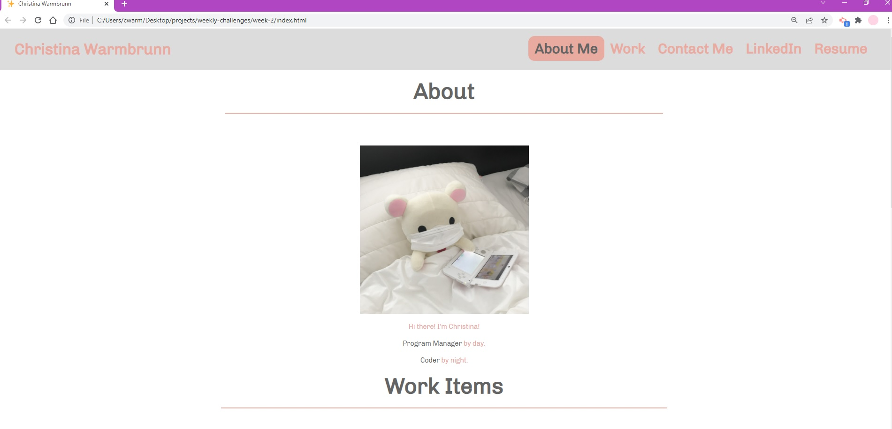

# Professional Portfolio Site

1. Project Title:

Professional Portfolio Site

2. Project Description:

   Designing a site for myself!

3. Installation:

   You can clone this repo - no special instructions to load this!

4. How to Run Project:

   Head over to https://cwarmbrunn.github.io/portfolio-week-2-challenge/ to view the page live!

5. Screenshots:

   
